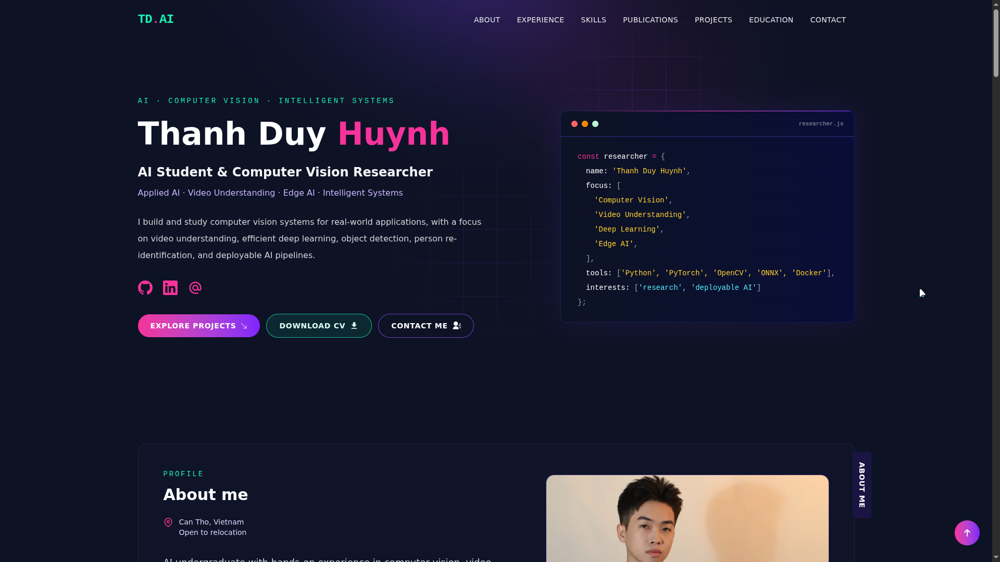
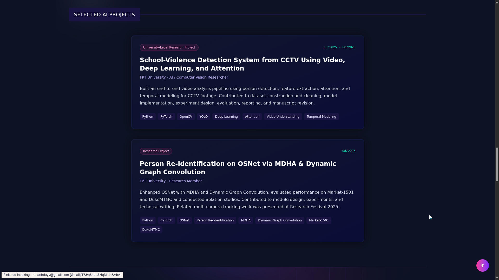

# Thanh Duy Huynh — AI & Computer Vision Portfolio

> AI Student · Computer Vision · Applied AI & Intelligent Systems

<p align="center">
  
</p>

<p align="center">
  
  
  
  
  
</p>

<p align="center">
  <a href="https://github.com/thduy-h">GitHub</a> ·
  <a href="https://www.linkedin.com/in/thduyh">LinkedIn</a>
</p>

Personal portfolio website of **Thanh Duy Huynh**, showcasing work in computer vision, deep learning, video understanding, person re-identification, explainable AI, edge AI, research, and deployable intelligent systems.

## About

I am an Artificial Intelligence undergraduate at FPT University with hands-on experience across:

- Computer Vision & Deep Learning
- Object Detection & Video Understanding
- Person Re-Identification
- Explainable AI
- Edge AI & Robotics
- Model Deployment
- Production-oriented AI workflows

My work combines research and practical engineering, from peer-reviewed computer vision studies to deployed AI and web systems.

## Tech Stack

- **Next.js 16**
- **React 19**
- **Tailwind CSS 4**
- JavaScript / JSX
- Docker
- Linux
- REST API integration

## Portfolio Content

Primary portfolio data is organized under:

```text
utils/data/
├── personal-data.js
├── experience.js
├── skills.js
├── publications.js
├── projects-data.js
├── educations.js
├── awards.js
└── leadership.js
```

Homepage components are located under:

```text
app/components/homepage/
```

## Featured Areas

### Research & Publications

- Similarity-Driven Grad-CAM++ for Explainable Person Re-Identification
- Human-Centric Violence Detection with YOLOv11-AFNet and TemporalSA-MoViNet
- Ghost-YOLOv11 for Real-Time Mango Counting
- HALE-YO for Aerial Tiny Person Detection

### Selected Projects

- **VNNETZERO** — Digital platform for Net Zero and green behavior governance
- **SAYNTAX** — Voice-driven coding initiative for accessible web development
- School-Violence Detection System
- Person Re-Identification with MDHA & Dynamic Graph Convolution

## Local Development

Requirements:

- Node.js 20+
- pnpm

Install dependencies:

```bash
pnpm install
```

Start development server:

```bash
pnpm dev
```

Open:

```text
http://localhost:3000
```

Production check:

```bash
pnpm lint
pnpm build
pnpm start
```

## Environment Variables

No environment variables are required for the current portfolio build.

Google Tag Manager is optional:

```env
NEXT_PUBLIC_GTM=GTM-XXXXXXX
```

## CV & Profile Assets

The portfolio includes:

```text
public/Thanh-Duy-Huynh-CV.pdf
public/thanh-duy-huynh.webp
```

The supplied personal logo is also used as the site favicon.

## Preview

<p align="center">
  
  
</p>

## Contact

**Thanh Duy Huynh**

- GitHub: [@thduy-h](https://github.com/thduy-h)
- LinkedIn: [thduyh](https://www.linkedin.com/in/thduyh)

Open to opportunities in AI engineering, computer vision research, applied AI, and technical collaboration.

## License & Attribution

This portfolio was customized from the open-source `developer-portfolio` template.

Original project attribution is retained where applicable.
